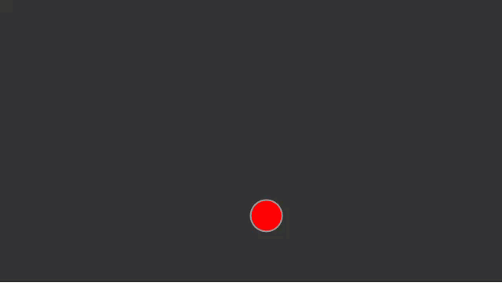

# Vector Motion Acceleration

1. [mover02.js](mover/)

```js
var mover;

function setup() {
  createCanvas(640,360);
  mover = new Mover();  
}
```

```js
function draw() {
  background(51);

  mover.update();
  mover.checkEdges();
  mover.display();
}

```

