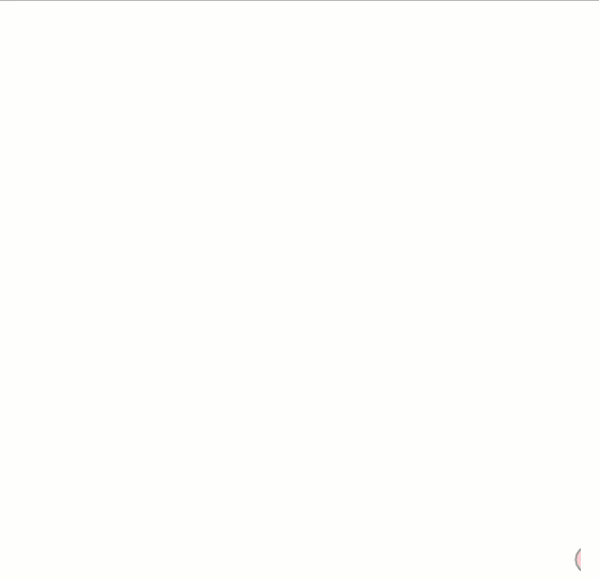

# Look at our Mover Class

1. [mover](mover/)

What is happening with the sketch,  First we are setting up the mover which is created in the mover.js sketch. The canvas which we place our mover on it then created the mover.

our next step would be to create the wind we apply that to our force and to make sure our mover doesn't leave the canvas we add the checkEdges.

```js
var mover; // setting our mover

function setup() {
  createCanvas(640, 640); //creating the canvas
  mover = new Mover();  
}
function draw() {
  var wind = createVector(0.1, 0.1);
  background(255);

  mover.applyForce(wind); //applying the force to wind
  mover.checkEdges(); //making sure the mover does leave the canvas
  mover.update(); //updating our mover
  mover.display(); // display our mover on the canvas
}
```

