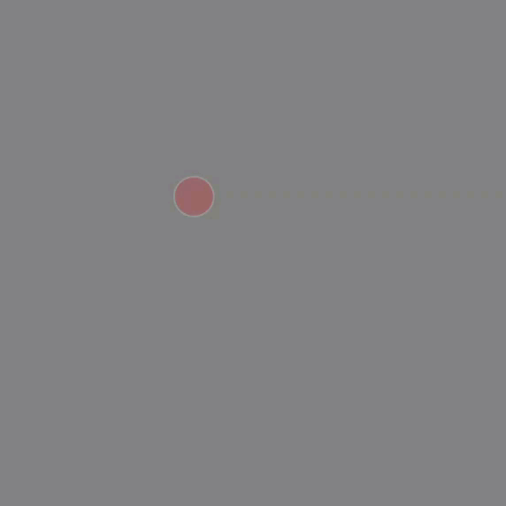

# Liquid Experiment

1. [mover](mover/)

```js
var ball;

function setup() {
  createCanvas(640, 640);
  //_x, _y, _vx, _vy, _ax, _ay, mass
  ball = new Mover(200, 200, 2, 2, 0, 0, 5);
}
```
```js
function draw() {
  background(127);

   ball.update();
   ball.display();
   ball.checkEdges();
}

```

