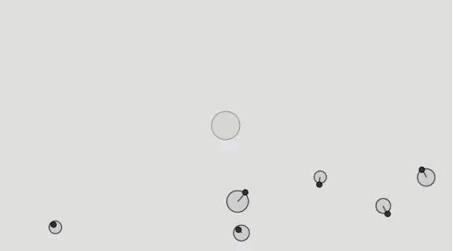

# Attraction Array with Oscillation

1. [attractor.js](attractor/)
2. [crawlers.js](crawlers/)
3. [oscillator.js](oscillator/)

In this sketch we are using two other sketch's an attractor.js and crawlers.js but first will talk about our main sketch.  We are setting up are crawlers

```js
var crawlers = []; // setting our array of crawlers
var a; // setting

function setup() {
  createCanvas(640, 360);
  // Some random bodies
  for i = 0; i < 6; i++) {
    crawlers[i] = new Crawler();
  }
  // Create an attractive body
  a = new Attractor(createVector(width / 2, height / 2), 20, 0.4);
}
```

```js
function draw() {
  background(220);
  a.rollingover(mouseX, mouseY);
  a.go();

  for (var i = 0; i < crawlers.length; i++) {
    // Calculate a force exerted by "attractor" on "Crawler"
    var f = a.attract(crawlers[i]);
    // Apply that force to the Crawler
    crawlers[i].applyForce(f);
    // Update and render
    crawlers[i].update();
    crawlers[i].display();
  }
}
```
Now we have the added extra in our sketch of a mouse press and a mouse release what is that doing to our sketch

```js
function mousePressed() {
  a.clicked(mouseX, mouseY);
}

function mouseReleased() {
  a.stopDragging();
}
```

