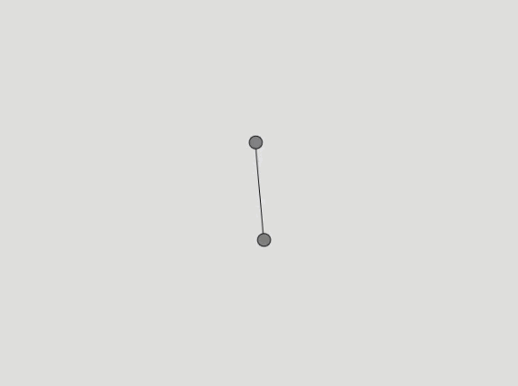

# Rotate a Baton
With code below we are going to create a baton within a canvas, we are going to use angle and rotate the baton.  The baton is going to be moved with acceleration.

The first part of the code we are setting the value of the angle to 0 giving the velocity of 0 and the giving acceleration of 0.002.  In the setup we are leaving the canvas to the size of 640 and 480.  

```js
var angle = 0; //setting angle to zero
var aVelocity = 0;
var aAcceleration= 0.002;

function setup() {
  createCanvas (640, 480); // Creating the canvas
}
```

We are translating by the width and height and rotate the baton with angle, we then draw our line first and the two circle to make our baton. To move the baton we are adding acceleration to the velocity, if you do not add the constrain to the velocity the baton would be spinning so fast that it would look out of control so the constrain slow down our baton.

```js
function draw() {
  background(220); // The background of the canvas

  stroke(0); // setting the stroke to zero
  fill(127); // setting the fill to a gray

  push();//push - saves the drawing style
  translate(width / 2, height / 2);  //
  rotate(angle); // rotating by the angle that as been pre-sent above
  line(-60, 0, 60, 0); // the line that is being  drawn between the two ellipse
  ellipse(60, 0, 16, 16); // drawing the first circle
  ellipse(-60, 0, 16, 16); //drawing the second circle
  pop(); // restores the the these setting

  aVelocity = aVelocity + aAcceleration; // adding acceleration to velocity
  aVelocity = constrain(aVelocity, 0, 0.1); // adding the constrain to slow it donw
  angle = angle + aVelocity; // taking the velocity and adding it to the angle
}


```

