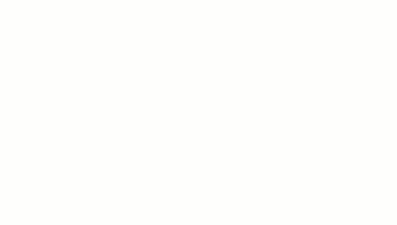

# Angular Motion

What we are doing with in this sketch is having our baton moving faster and using angle to have it moving in two directions.
The setting for the first part of the code is still the same as our code used in rotating a baton we are just reduced down the acceleration to 0.001.

```js
var angle = 0; //setting angle to zero
var aVelocity = 0; //
var aAcceleration= 0.001;

function setup() {
  createCanvas (640, 360); // Creating the canvas
}
```
The below code has changes first of all we have also removed push and pop.  To make sure we get the speed of the baton we have removed the constrain again as before we are drawing the line first of the baton then the circle one for the top and second for the bottom of our line.

```js
function draw() {
  background(225); // The background of the canvas

  stroke(0); // setting the stroke to zero
  fill(175); // setting the fill to a gray

  translate(width/2, height/2);  
  rotate(angle); // rotating by the angle that as been pre-sent above
  line(-50, 0, 50, 0); // the line that is being  drawn between the two ellipse
  ellipse(50, 0, 8, 8); // drawing the first circle
  ellipse(-50, 0, 8, 8); //drawing the second circle

  aVelocity = aVelocity + aAcceleration; // adding acceleration to velocity
  angle = angle + aVelocity; // taking the velocity and adding it to the angle
}

```

