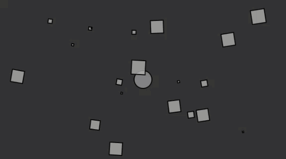

# Forces with Arbitrary

1. [mover](mover/)
2. [attractor](attractor/)

```js
var movers = [];
var attractor;

function setup() {
  createCanvas(640, 360);

  for ( i = 0; i < 20; i++) {
    movers.push(new Mover(random(0.1, 2), random(width), random(height)));
  }
  attractor = new Attractor();
}
```

```js
function draw() {
  background(51);

  attractor.display();

  for (var i = 0; i < movers.length; i++) {
    var force = attractor.calculateAttraction(movers[i]);
    movers[i].applyForce(force);

    movers[i].update();
    movers[i].display();
  }
}

```

