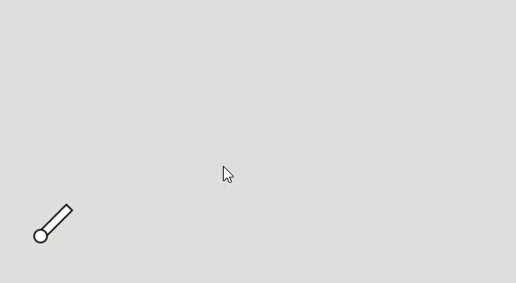

# Cannonball

1. [Cannonball](cannonball/)

```js
// All of this stuff should probably go into a Cannon class
var angle;
var position;
var shot = false;

var ball;

function setup() {
  createCanvas(640, 360);
  angle = -PI / 4;
  position = createVector(50, 300);
  ball = new CannonBall(position.x, position.y);
}
```
```js
function draw() {
  background(220);

  push();
  translate(position.x, position.y);
  rotate(angle);
  rect(0, -5, 50, 10);
  pop();

  if (shot) {
    var gravity = new createVector(0, 0.2);
    ball.applyForce(gravity);
    ball.update();
  }
  ball.display();

  if (ball.position.y > height) {
    ball = new CannonBall(position.x, position.y);
    shot = false;
  }

  if (keyIsDown(RIGHT_ARROW)) {
    angle += 0.1;
  } else if (keyIsDown(LEFT_ARROW)) {
    angle -= 0.1;
  }
}
```

```js
function keyPressed() {
  if (key == ' ') {
    shot = true;
    var force = p5.Vector.fromAngle(angle);
    force.mult(10);
    ball.applyForce(force);
  }
}

```

