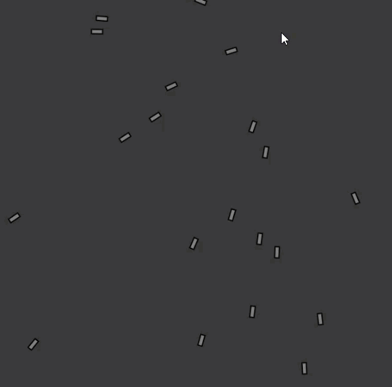

# Towards the mouse

1. [mover](mover/)

```js
var movers = [];

function setup() {
    createCanvas(640, 640);
    for (var i = 0; i < 20; i++)
      movers[i] = new Mover;
}
```

```js
function draw() {

    background(55);

    for (var i = 0; i < 20; i++){
    //movers[i].checkEdges();
    movers[i].update();
    movers[i].display();
  }
}
```

