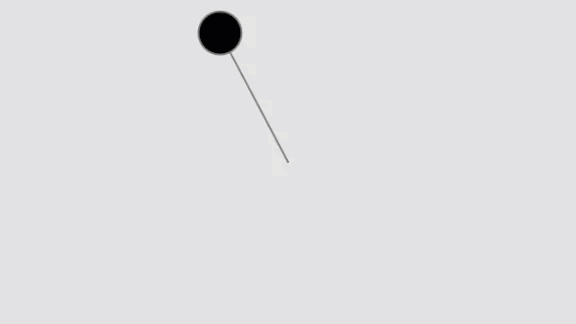

# Polar Cartesian

```js
var r;
var theta;

function setup() {
  createCanvas(640, 360);
  // Initialize all values
  r = height * 0.45;
  theta = 0;
}
```

```js
function draw() {
  background(225);

  // Translate the origin point to the center of the screen
  translate(width / 2, height / 2);

  // Convert polar to cartesian
  var x = r * cos(theta);
  var y = r * sin(theta);

  // Draw the ellipse at the cartesian coordinate
  ellipseMode(CENTER);
  fill(0);
  stroke(127);
  strokeWeight(2);
  line(0, 0, x, y);
  ellipse(x, y, 48, 48);

  // Increase the angle over time
  theta += 0.02;
}
```

