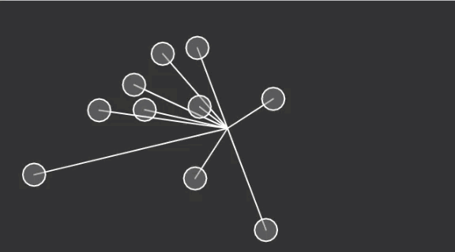

# Oscillating Object

1. [Oscillating](oscillating/)

```js
// An array of objects
var oscillators = [];

function setup() {
  createCanvas(640, 360);
  // Initialize all objects
  for (var i = 0; i < 10; i++) {
    oscillators.push(new Oscillator());
  }
}
```

```js
function draw() {
  background(51);
  // Run all objects
  for (var i = 0; i < oscillators.length; i++) {
    oscillators[i].oscillate();
    oscillators[i].display();
  }
}
```

