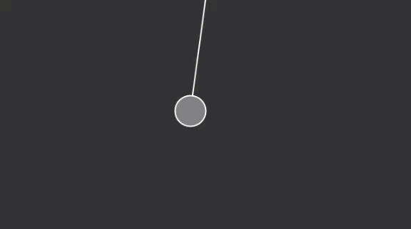

# Pendulum Simplified

1. [Pendulum](pendulum/)

```js
var p;

function setup() {
  createCanvas(640, 360);
  // Make a new Pendulum with an origin position and armlength
  p = new Pendulum(createVector(width / 2, 0), 175);

}
```

```js
function draw() {
  background(51);
  p.go();
}
```

