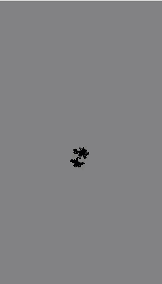

[Introduction](../)

# Random Walker with 9 Outcomes
The first half of the below has not changed from Random Walker with 4 outcomes.
The canvas layout and background is the same, next creating a new walker.  

Within the draw function we have not changing anything we are still calling for the walker to be rendered and walker step.

```js
var walker;

function setup() {
    createCanvas(320, 640); //Creating a canvas setting its height and width
    background(127); //setting the background color
    walker = new Walker(); //creating the new walker
}

function draw() {
  walker.render(); //calls the render on each frame
  walker.step(); //calls step on each frame
}
```
The next part of the code see the x = to the width of the canvas which is are divided in half, y is = to the height of the canvas which again we is divided in half.

```js
function Walker() {
  this.x = width / 2;
  this.y = height /2;

  this.render = function (){
    stroke(0);
    point(this.x, this.y);
  }
```


```js
this.step = function () {
  var stepx = floor(random(-1, 2));
  var stepy = floor(random(-1, 2));

  this.x = this.x + stepx;
  this.y = this.y + stepy;

  this.x = constrain(this.x, 0, width);
  this.y = constrain(this.y, 0, height);
  }
}
```


[See the Code in action](index.html)
