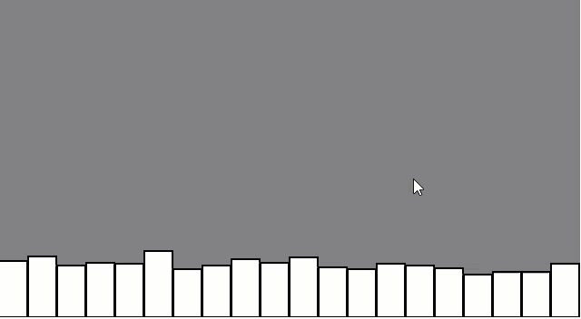

[Introduction](../)

# Uniform Distribution of Numbers

The first half of code you will see that we are declaring and array called randomCount and a variable called total for the number of items that are in the array.

Within in the setup() we have created a canvas with a width and height.  
There is a loop that is populates an array within the canvas.

```js
var randomCounts = [];
var total = 20;

function setup() {
    createCanvas(640,360);
    for (var i = 0; i < total; i++) {
      randomCounts[i] = 0;
    }
}
```
The draw function we are redrawing the background on each frame.  Within this we are choosing a random number between 0 and 20, the floor we will only choose the number between 0 and 19.  

We are givin a strokeWeight of two and setting the background of the canvas to white.

The below code loops 20 times this is for each bar and it creates the rectangle with height.

```js
function draw() {
  background(127);
  var index = floor(random(total));
  randomCounts[index]++;

//Draw a rectangle to graph results
stroke(0);
strokeWeight(2);
fill(255);

var w = width/randomCounts.length;

for (var x = 0; x < randomCounts.length; x++) {
  rect(x*w, height-randomCounts[x], w-1,
      randomCounts[x]);
    }

```

