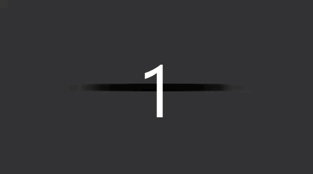

[Introduction](../)
# Gaussian Distribution
The Gaussian Distribution lets take the height of people within your area from the shortest person to the tallest
Within the draw function the first line of code we are getting the Gaussian random number.   

The second half of the code we are defining the standard deviation, we then define the mean of the value this means the middle of the screen along the x-axis.

The third line of the code is the Gaussian random number by standard deviation and mean.

```js
function setup() {
    createCanvas(640, 360);
    background(127);
}

function draw() {
  var xloc = randomGaussian();
  console.log(xloc);

var sd = 60;
var mean = width /2;
xloc = (xloc * sd) + mean;

fill(0,10);
noStroke();
ellipse(xloc, height / 2, 16, 16);
}
```

