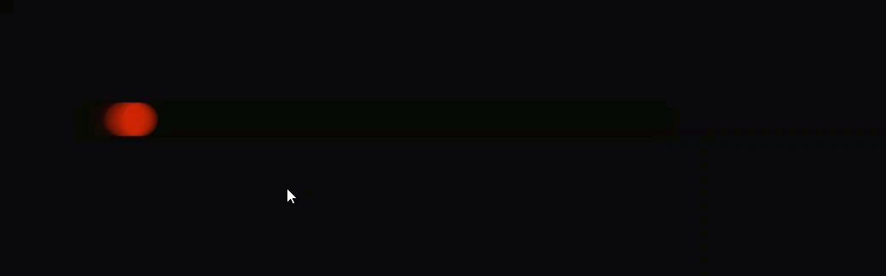

[Introduction](../)

# One Dimensional Noise
With one dimensional noise we are introducing Perlin noise which is named after the inventor
Ken Perlin.  What is Perlin noise is a gradient noise that creates computer generated effects for the movie
Tron in the 1980's.

Perlin noise can be use to create effects like clouds, landscapes and textures like marble.

The code below has not changed from the code that has already be done in a previous walker program.

In the draw function we are drawing a black rectangle in a loop with a 15% opacity with every frame.

```js
var walker;

function setup() {
    createCanvas(1200, 1000);
    walker = new Walker();
    background(127);
}

function draw() {
    fill(0, 15);
    rect(0, 0, width, height);
    walker.step();
    walker.render();
}

function Walker() {
    this.x = width / 2;
    this.xOff = random(1000);

    this.render = function () {
      noStroke();
      fill(255, 45, 0, 50);
      ellipse(this.x, 500, 40, 40)
    }
    this.step = function(){
      this.x = map(noise(this.xOff), 0, 1, 0, width);
      this.xOff += 0.005;
    }
}
```
The function walker the x position starts in the middle of our canvas.  The xOff
random number is set between 0 and 1000.  This represents the time of the noise function
when it is called.

At the end of the code we draw the ellipise with 50% opacity.


